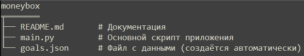
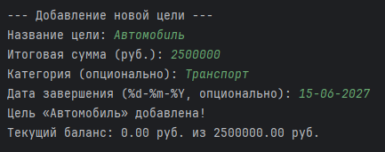
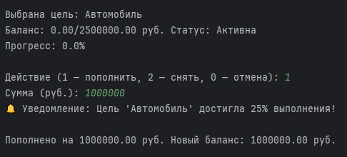
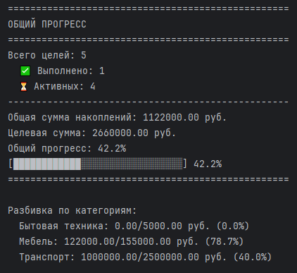
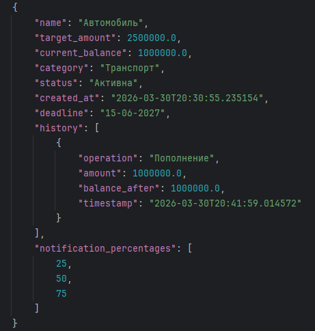

# Денежная копилка

**Версия:** 1.1.0  
**Автор:** Михаил Качаргин


## Описание

«Денежная копилка» — это консольное приложение на Python для управления личными финансовыми целями.
Оно позволяет создавать цели накопления, отслеживать прогресс, вести историю операций, устанавливать дедлайны
и получать уведомления о достижении заданных процентов выполнения.

Программа хранит все данные в JSON-файле, что обеспечивает их сохранность между сеансами работы.


## Функциональные возможности

- **Добавление цели** – указание названия, итоговой суммы, категории (опционально) и даты завершения.
- **Изменение баланса** – пополнение или снятие средств с проверкой на превышение целевой суммы или уход в минус.
- **Удаление цели** – с подтверждением.
- **Просмотр общего прогресса** – сводка по всем целям: общая сумма накоплений, количество завершённых и активных целей,
визуальный прогресс-бар, разбивка по категориям.
- **Подробная информация о цели** – текущий баланс, прогресс, дата завершения, ожидаемая дата завершения 
(на основе истории операций), история всех транзакций.
- **Фильтрация целей по категории** – отображение только целей выбранной категории с подсчётом итогов по категории.
- **Настройка уведомлений** – задание процентов выполнения (от 1 до 99), при достижении которых программа выведет
сообщение.
- **Автоматические уведомления**:
  - При достижении цели.
  - При приближении дедлайна (если до срока осталось менее 7 дней, а выполнено менее 80%).
  - При достижении заданных пользователем процентов выполнения.


## Структура проекта




### Классы и функции

- **`AppConfig`** – хранит константы приложения: имя файла, формат даты, тексты сообщений, пункты меню и др.
- **`Goal`** – класс, описывающий отдельную цель накопления:
  - Атрибуты: название, целевая сумма, текущий баланс, категория, статус, дата создания, дедлайн, история операций, 
    проценты для уведомлений.
  - Методы: пополнение/снятие средств (`add_funds`, `withdraw_funds`), логирование транзакций, вычисление процента
    выполнения, проверка необходимости уведомлений, установка дедлайна, расчёт ожидаемой даты завершения, проверка
    приближения дедлайна.
- **Функции работы с файлами** – `load_goals()`, `save_goals()`.
- **Функции пользовательского интерфейса** – отображение списка целей, выбор цели, обработка ввода с декоратором
    `handle_input_errors`.
- **Меню** – реализовано через словарь действий в функции `main()`.


## Требования

- Python 3.6 или выше.
- Никаких дополнительных библиотек не требуется (используется только стандартная библиотека).


## Установка и запуск

1. Скачайте файл `main.py` (или скопируйте код в одноимённый файл).
2. Убедитесь, что Python установлен и доступен в командной строке.
3. Запустите программу:
   ```bash
   python main.py
4. Следуйте инструкциям в меню.

**Примечание**: при первом запуске файл goals.json будет создан автоматически после добавления первой цели.


## Пример использования

### Добавление цели



### Пополнение цели



### Просмотр общего прогресса




## Формат данных

Данные сохраняются в файл goals.json в формате JSON. Пример записи:




## Часто задаваемые вопросы (FAQ)

**Вопрос**: Можно ли изменить уже существующую цель (например, целевую сумму)?

**Ответ**: В текущей версии изменение целевой суммы после создания недоступно. Вы можете удалить цель и создать
новую с нужными параметрами.


**Вопрос**: Как отключить уведомления о прогрессе?

**Ответ**: Настройте уведомления для цели, указав пустую строку или проценты вне диапазона 1–99. Либо удалите все 
проценты из списка.


**Вопрос**: Почему ожидаемая дата завершения не отображается?

**Ответ**: Для расчёта необходимо минимум два пополнения в истории. Если их недостаточно, дата не вычисляется.


**Вопрос**: Можно ли изменить категорию у существующей цели?

**Ответ**: В текущей версии нет. Если это необходимо, удалите цель и создайте заново.


## Планы по развитию

В следующих версиях планируется добавить:

- Редактирование существующих целей (изменение названия, целевой суммы, категории, дедлайна).
- Импорт/экспорт данных в CSV или Excel.
- Графический интерфейс (GUI) с использованием Tkinter или PyQt.
- Расширенная статистика (графики прогресса, отчёты).
- Поддержка валют (выбор валюты при создании цели).
- Экспорт истории операций.


## Лицензия

Данное программное обеспечение распространяется свободно. Вы можете использовать, модифицировать и распространять 
его без ограничений. Укажите оригинальную ссылку.


## Благодарности

Спасибо всем, кто тестировал приложение и предлагал идеи по его улучшению. Ваши отзывы помогают делать 
«Денежную копилку» удобнее и функциональнее.

[Ссылка на проект](https://github.com/happy-philosopher/moneybox)


